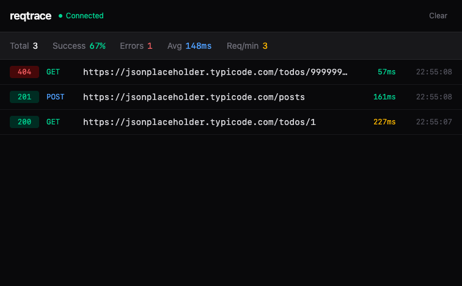

# reqtrace

Self-hosted HTTP request monitoring for Node.js. Drop in an Axios interceptor, see every outbound request in a realtime dashboard.



## Features

- **Realtime feed** — WebSocket-powered live log stream
- **Request inspection** — Expandable rows with headers, body, and JSON tree-view
- **Project filtering** — Tag requests by project, filter in the dashboard
- **Resend requests** — Replay any request from the dashboard
- **Virtual scrolling** — Smooth performance with thousands of entries
- **Fully self-hosted** — No cloud, no third-party services, you own your data

## Quick Start

```bash
# Clone and install
git clone https://github.com/emircan-sahin/reqtrace.git
cd reqtrace
pnpm install

# Set up PostgreSQL
createdb reqtrace
cp packages/server/.env.example packages/server/.env
# Edit .env if needed (defaults to postgresql://localhost:5432/reqtrace)

# Start server + dashboard
pnpm dev

# Run demo (sends requests every 50ms)
pnpm demo
```

Open [http://localhost:5173](http://localhost:5173) to see the dashboard.

## SDK Usage

Install the SDK in your project:

```bash
pnpm add reqtrace
```

```ts
import axios from 'axios'
import { ReqtraceCore, AxiosAdapter } from 'reqtrace'

const core = new ReqtraceCore({
  serverUrl: 'http://localhost:3100',
  projectName: 'my-api',
  captureBody: true,
})

const adapter = new AxiosAdapter(axios, core)
adapter.install()

// All axios requests are now logged to your dashboard
```

### Config Options

| Option | Type | Default | Description |
|--------|------|---------|-------------|
| `serverUrl` | `string` | — | Server URL (required for logging) |
| `projectName` | `string` | `'default'` | Project name for filtering |
| `captureBody` | `boolean` | `false` | Log request/response bodies |
| `maxBodySize` | `number` | `51200` | Max body size in bytes |
| `enabled` | `boolean` | `true` | Enable/disable logging |
| `filter` | `function` | `() => true` | Skip specific requests |

## Architecture

```
Your App (axios + reqtrace SDK)
        │
        │ WebSocket
        ▼
  reqtrace server (:3100)     ← PostgreSQL store, REST API
        │
        │ WebSocket
        ▼
  reqtrace client (:5173)     ← React dashboard
```

## Monorepo Structure

```
packages/sdk      → npm package (Axios interceptor + WebSocket transport)
packages/server   → Fastify backend (WebSocket + REST API)
packages/client   → React dashboard (Tailwind + @tanstack/react-virtual)
examples/         → Demo script
```

## Development

```bash
pnpm dev            # Start server + client
pnpm dev:server     # Start server only
pnpm dev:client     # Start client only
pnpm demo           # Run demo requests
pnpm build          # Build all packages
pnpm test           # Run all tests
```

## Server API

| Endpoint | Description |
|----------|-------------|
| `GET /health` | Health check |
| `GET /api/logs` | List logs (filterable, paginated) |
| `POST /api/logs` | Ingest a log entry |
| `GET /api/projects` | List project names |
| `POST /api/resend` | Replay a request |
| `WS /ws` | Realtime log stream |

## Tech Stack

| Package | Stack |
|---------|-------|
| SDK | TypeScript, axios (peer dep), ws |
| Server | Fastify, @fastify/websocket, PostgreSQL, Zod |
| Client | React, Tailwind CSS, @tanstack/react-virtual |

## License

MIT
